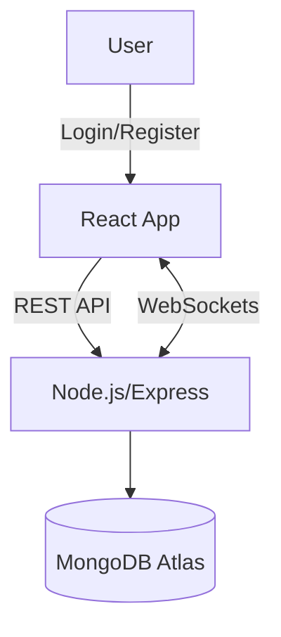

## Architecture Overview

The application follows a **client-server architecture** designed for simplicity, real-time messaging, and scalability. It separates concerns between the frontend, backend, and database while enabling secure authentication and instant message delivery.

### Components

1. **Frontend (React)**

   - Handles the **UI/UX**: login/register, contacts list, chat window.
   - Fetches data from the backend via **REST API** (authentication, message history).
   - Connects to backend with **WebSockets (Socket.IO)** for real-time message delivery.

2. **Backend (Node.js + Express)**

   - Provides **REST endpoints** for authentication, user management, and fetching chat history.
   - Manages **WebSocket connections** for real-time messaging.
   - Implements **JWT authentication** for stateless security.
   - Validates and persists messages to the database.

3. **Database (MongoDB Atlas)**
   - Stores **users**, **chats**, and **messages**.
   - Supports fast querying for chat history and user lists.
   - Allows flexible schema evolution for future features (e.g., groups, media messages).

### Data Flow

